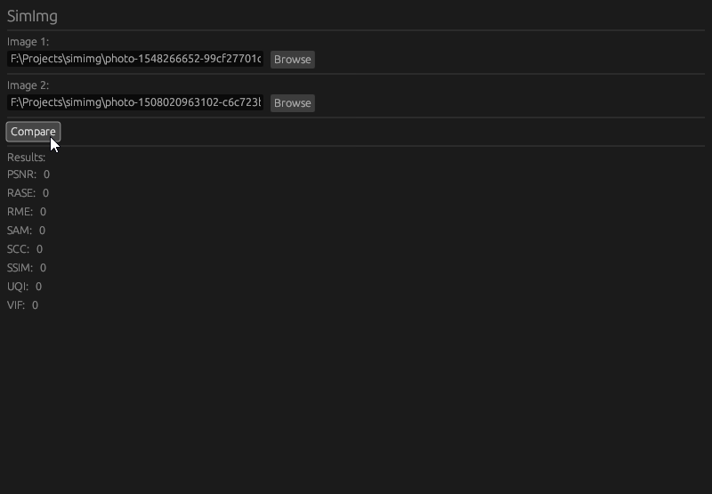

# Simimg 🖼



Simimg is a simple image comparison tool. It can be used to compare two images and output the difference between them.


## Installation

### Manual

```bash
git clone https://github.com/yashraj-n/simimg
cd simimg
cargo run
```
---

### Download pre-built binaries

You can download pre-built binaries from the [releases](https://github.com/yashraj-n/simimg/releases) page.

## Functions

---
- PSNR: Peak Signal-to-Noise Ratio 
---

- RASE: Relative Average Spectral Error 
---
- RME: Root Mean Error 
---
- SAM: Spectral Angle Mapper 
---
- SCC: Spatial Correlation Coefficient 
---
- SSIM: Structural Similarity Index 
---
- UQI: Universal Quality Image Index 
---
- VIF: Visual Information Fidelity 


## License

This project is licensed under the MIT License - see the [LICENSE](LICENSE) file for details
